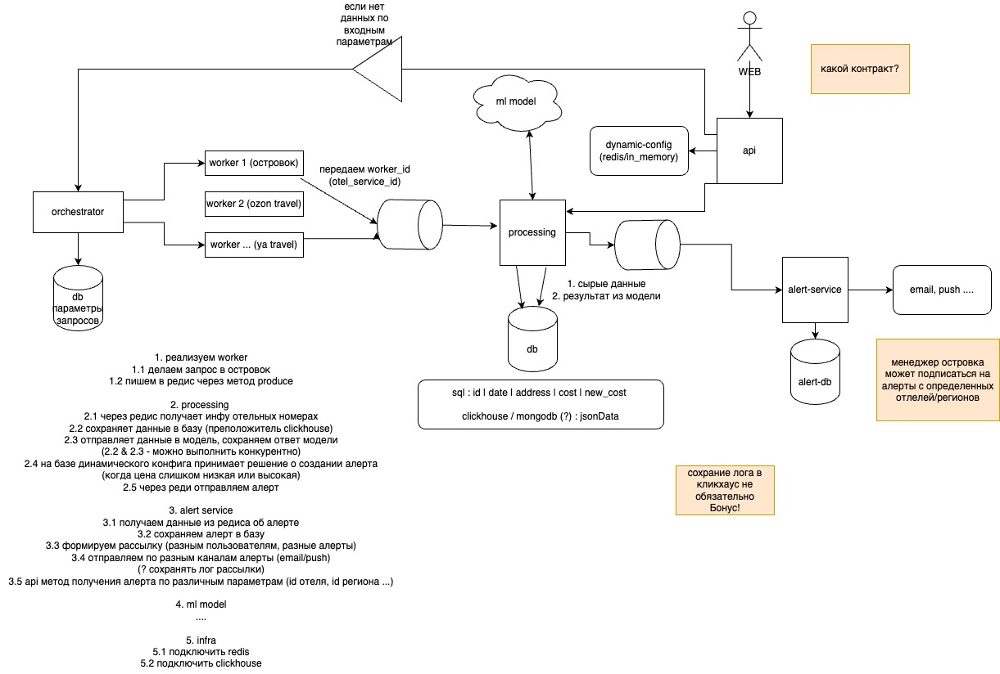

# О! Хакатон — The Bits – Динамическое ценообразование

## Описание решения

> Общее описание, на чём основано

### Архитектура

## Как запускать

docker-compose up -d

## Другие комментарии

Презентация находится в директории docs
